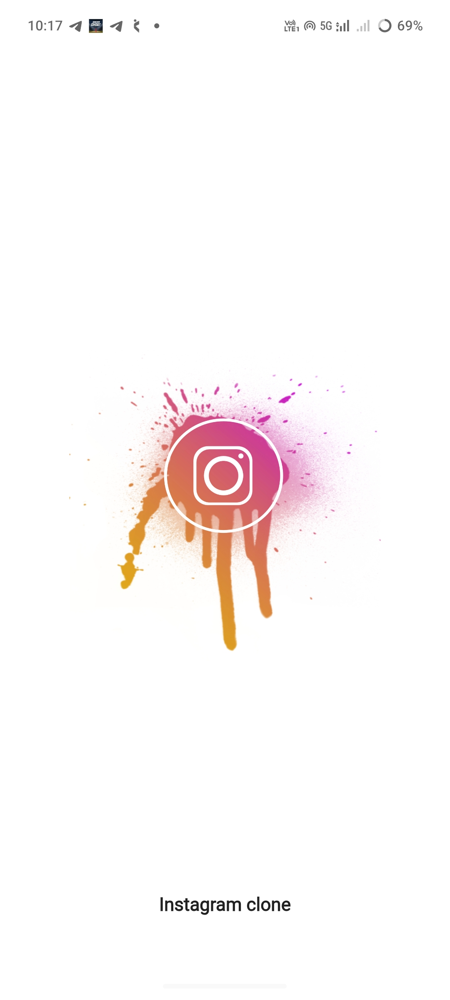
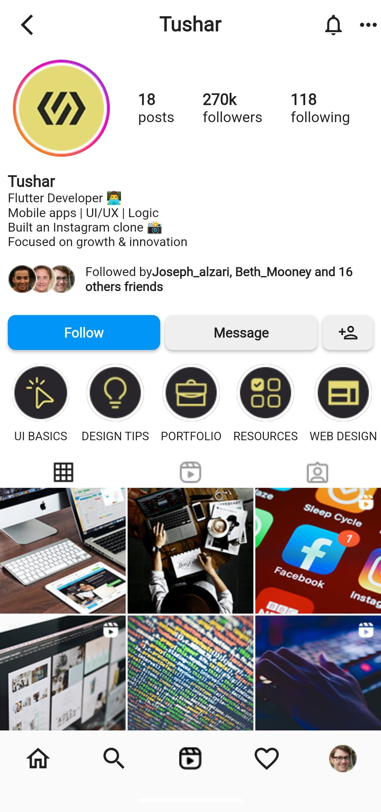
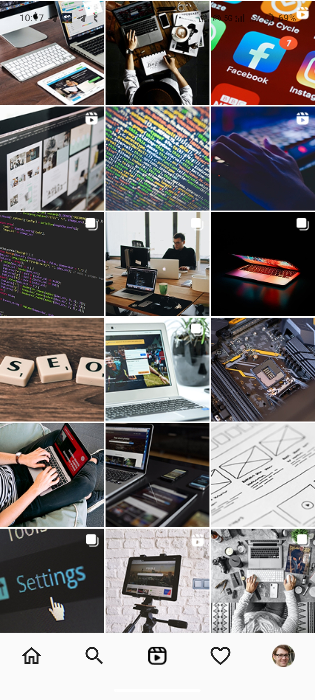
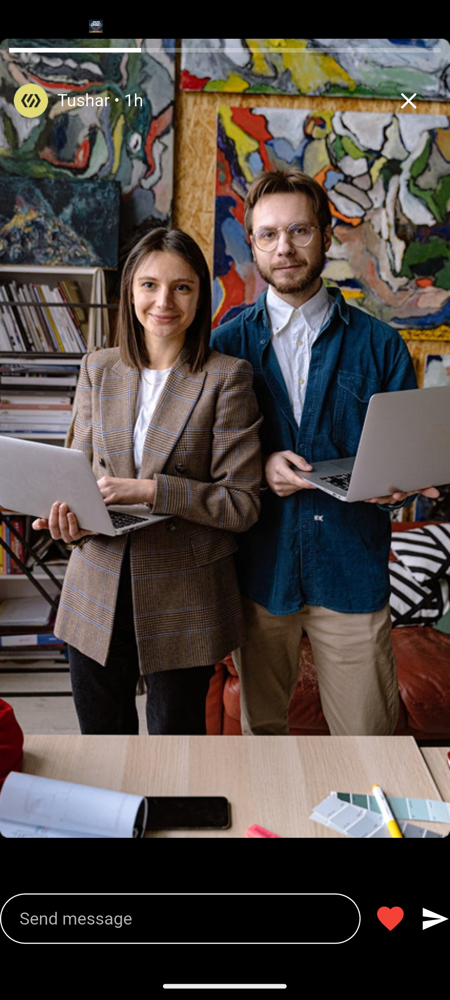

# 📸 Instagram Clone UI (Flutter)

A **Flutter-based Instagram Profile & Stories UI clone**, built for **learning and UI practice**.

This project focuses on recreating Instagram’s **profile screen**, **story view**, and **basic interactions** using Flutter widgets like  
`SliverAppBar`, `CustomScrollView`, and animations.

> ⚠️ **Note:** This is a **UI-only project**.  
> No backend, database, or real authentication is implemented.

---

## 🚀 Preview

### Splash Screen                                 


### Profile Screen


### Posts UI


### Stories UI



## ✨ Features

### 📱 Profile Screen
- Instagram-style profile layout
- SliverAppBar with smooth scroll behavior
- Posts grid layout
- Highlights section (horizontal list)

### 📸 Stories
- Auto progress bar
- Auto close after 8 seconds
- Swipe down to dismiss
- Seen / Not-seen story logic
- Like / Unlike story interaction ❤️

### 👤 Interactions
- Follow → Following button logic
- Dropdown arrow with bottom sheet
- Unfollow option
- Bottom Navigation Bar
- Like / Unlike toggle logic (Instagram-style)

### 🚀 Splash Screen
- Custom splash screen on app launch
- App logo display
- App name text shown at the bottom
- Smooth transition to home screen

---

## 🎨 Design & Assets Credit

This project uses **UI inspiration and assets** from a **Figma Community design**:

🔗 **Figma Design Link**  
https://www.figma.com/design/aSc9nOJZopi9mzSGOml84E/Instagram-Profile-and-Stories-Mockup--2024---Community-

> 📌 Design and assets are used **only for learning and practice purposes**.  
> All credits go to the **original designer(s)** from the Figma Community.

---

## 🗂️ Project Structure

```txt
lib/
│
├── main.dart                 # App entry point
├── app.dart                  # App theme, colors, MaterialApp
│
├── Screens/
│   ├── my_account.dart       # Profile screen (Sliver-based UI)
│   └── my_story.dart         # Story view screen
│   └── splash.dart           # Splash screen
├── data/
│   └── assets.dart           # Dummy data (posts, highlights)
│
assets/
│
├── images/
│   ├── icons/                # Bottom navigation icons
│   ├── posts/                # Post grid images
│   ├── story_and_highlights/ # Story images
│   ├── tabs/                 # Profile tab icons
│   │   ├── story.png
│   │   ├── story_seened.png
│   │   └── story_not_seen.png 
│   └── misc/                 # Other UI images
│
└── pubspec.yaml

```

## 🚀 Getting Started

### Prerequisites
- Flutter SDK installed
- Android Studio or VS Code
- Emulator or physical device
  
### Run the project
```
flutter pub get
flutter run
```

### 🛠️ Tech Stack
- Flutter
- Dart
- Material Design Widgets
- Sliver Widgets
- Custom animations & gestures

### 📌 Project Status
- ✅ UI completed
- 🔧 Backend: Not implemented
- 📚 Purpose: Learning Flutter UI & layouts

### 📄 Disclaimer
- This project is not affiliated with Instagram or Meta.
  
- It is created only for educational and learning purposes.
- All trademarks, logos, and designs belong to their respective owners.
